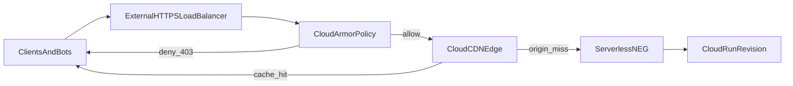

## Why the bill jumps

Cloud Run billing spiked. Logs Explorer showed the usual scanner noise:

- `GET /wp-login.php`
- `GET /wp-admin/setup-config.php`
- `GET /.env`

The app is **Next.js**, not WordPress. No PHP on the stack. Every probe still returns **404** — and you still pay for it.

Cloud Run bills **requests** and **instance time** (CPU/memory while instances handle concurrency). A scanner does not need a real page. Enough parallel junk can:

- **Raise concurrency** and keep instances busy on cheap 404s.
- **Trigger autoscaling** and cold starts when bursts outrun idle capacity.

Next.js middleware can block some of this, but it still burns **container CPU**. Cheaper to cut noise at the **load balancer**: deny obvious paths before Cloud Run sees them, and let the **CDN cache 404s** so repeat probes skip the origin.

## Architecture: three layers



| Layer | Role | What you gain |
| :--- | :--- | :--- |
| **Cloud Armor** | WAF-style rules on the **backend service** attached to the load balancer | Obvious scanner paths return **403** at the LB edge; traffic **does not reach** the serverless NEG or Cloud Run. |
| **Cloud CDN** | Edge caching, including **negative caching** for error responses | After a path legitimately returns **404** once, repeat requests can be served from the edge (very low origin cost). |
| **Ingress control** | Cloud Run accepts only **internal + load-balanced** traffic | The default **`*.run.app`** URL is no longer a public bypass around Armor and CDN. Users hit **your domain on the LB** only. |

## Layer 1 — Cloud Armor as the first filter

Bots rotate IPs, so a static IP block list does not scale. **Custom rules** in a Cloud Armor **security policy** use **CEL** (Common Expression Language) on request attributes; regex uses **RE2** via `matches()`.

**Examples (tune priorities to your policy):**

- **PHP probes:** deny paths ending in `.php` (adjust if you ever serve real `.php` assets—most Next.js stacks do not).

```text
request.path.matches('(?i:.*\\.php$)')
```

- **WordPress-shaped paths** (normalize case if your clients send odd casing—`contains` is literal; `request.path.lower()` is an option per the [rules language reference](https://docs.cloud.google.com/armor/docs/rules-language-reference)):

```text
request.path.contains('/wp-admin/') || request.path.contains('/wp-content/')
```

- **Sensitive file extensions** (extend as needed):

```text
request.path.matches('(?i:.*\\.(env|git|bak|sql|config)(/|$))')
```

**Rules that matter:**

- Put **specific rules above broad ones** in priority order.
- **Managed rules** (OWASP CRS, Google-managed rules, Adaptive Protection) catch attack classes regex misses — worth adding on top of path blocks.
- **False positives:** test in preview mode if you can, then `deny(403)` (or `deny(404)` if you do not want to advertise a block).

Deny actions evaluated at the **load balancer** mean those requests **never invoke** Cloud Run: no container CPU for that request line item.

## Layer 2 — CDN: negative caching, not “cache everything”

Do not turn on **force-cache-all** (`CACHE_MODE_FORCE_CACHE_ALL` or the console equivalent) for a **dynamic** Next.js app — you can cache **200** responses that should stay private or vary per user.

For scanner traffic, use **negative caching**:

- Configure the backend service / CDN settings so **404** (and optionally **403** if your origin returns them for unknown routes) can be cached at the edge for a bounded TTL (for example **many hours** for static junk paths).
- **Trade-off:** a long **404** TTL also freezes real mistakes. Ship a bad route, and the edge may keep serving 404 until expiry. Balance scan noise vs recovery time — or purge cache when you can.

Use normal cache rules for static assets (`public/`, hashed filenames). Do not force one cache mode over the whole app.

## Layer 3 — Close the `*.run.app` bypass

If the load balancer is public but the **Cloud Run service URL** is still open to the internet, scanners will hit **`https://<service>-<hash>-<region>.a.run.app`** directly and **skip Cloud Armor and CDN**.

**Fix (console wording):** Cloud Run **Ingress** → **Allow internal traffic and traffic from Cloud Load Balancing** (API: ingress traffic limited to internal sources and Google Cloud external HTTP(S) load balancers—see current [Cloud Run ingress documentation](https://cloud.google.com/run/docs/securing/ingress) for exact labels in your project).

Pair that with **DNS and TLS on the external HTTPS load balancer** as the only customer-facing entry.

## Setup steps

1. **Serverless NEG** — point a serverless Network Endpoint Group at the **Cloud Run** service (region, service name).
2. **Backend service** — use that NEG as the backend; enable **Cloud CDN** on the backend service when it fits your caching plan.
3. **URL map + HTTPS proxy + forwarding rule** — global external **Application Load Balancer (HTTP/S)** fronting the backend.
4. **Cloud Armor** — create a security policy, attach it to the **backend service**, add CEL rules (start strict on obvious scanner paths).
5. **CDN tuning** — enable **negative caching** for **404** (optional **403**); avoid blanket **force-cache-all** for dynamic apps.
6. **Cloud Run ingress** — restrict to **internal + Cloud Load Balancing**; verify the default `run.app` URL no longer accepts public probes.
7. **Validate** — `curl` against the LB hostname vs direct `run.app`; confirm denied paths never appear in **Cloud Run request logs**.

## What to look for in logs

Log field names change between schema versions; search by intent:

- **Load Balancer / Armor:** filter for **deny** outcomes, matched rule names, and **low backend request volume** for garbage paths.
- **CDN:** filter for **cache fill / hit** indicators vs **origin round-trips**; repeat scans of the same dead path should show **edge satisfaction** rather than new Cloud Run instances spinning up.
- **Cloud Run:** request logs trend toward **legitimate routes** (for example **200** on real pages) rather than dense **404** storms during idle periods.

Before hardening, **“Starting new instance”** often lined up with scan bursts. Afterward that noise drops on blocked paths — the origin never sees them, or sees them once per cache key before negative caching kicks in.

## LB cost

A global HTTPS load balancer is not free: forwarding rules, proxy infra, data processing — prices vary by region.

It is still cheaper than letting scanner concurrency drive **Cloud Run** instance time without a cap.

Middleware can express policy; it spends **container** resources. **Cloud Armor** on the backend service, **CDN negative caching** where safe, and **ingress locked to load balancing only** cut junk before your revision runs.

For Terraform, codify the NEG, backend service, URL map, Armor attachment, and CDN flags next to the Cloud Run service — same split as in the Cloud Run delivery-flow write-up.
