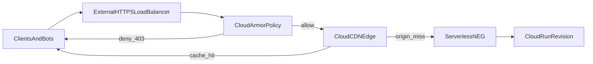

## Why the bill spikes anyway

One Monday you open Billing and Cloud Run is up sharply. In Logs Explorer the traffic looks like junk:

- `GET /wp-login.php`
- `GET /wp-admin/setup-config.php`
- `GET /.env`

Your app is **Next.js**, not WordPress, and there is no PHP. Every probe still returns **404**—and that is the trap.

**Cloud Run charges for real work at the edge of the platform:** you pay for **requests** and for **billable instance time** (CPU and memory allocated while instances handle concurrency). A scanner does not need a “successful” page to cost money. Enough parallel junk requests can:

- **Raise concurrency** and keep instances busy serving cheap 404s.
- **Trigger autoscaling** and cold starts when bursts arrive faster than idle capacity.

Application-layer fixes (Next.js middleware, route handlers) help, but they still spend **your container’s CPU** on noise. The cheaper pattern is **defense in depth at Google’s front door**: deny obvious abuse before Cloud Run sees it, and **cache safe negatives** at the CDN so repeat probes do not hit the origin.

## Architecture: three layers



| Layer | Role | What you gain |
| :--- | :--- | :--- |
| **Cloud Armor** | WAF-style rules on the **backend service** attached to the load balancer | Obvious scanner paths return **403** at the LB edge; traffic **does not reach** the serverless NEG or Cloud Run. |
| **Cloud CDN** | Edge caching, including **negative caching** for error responses | After a path legitimately returns **404** once, repeat requests can be served from the edge (very low origin cost). |
| **Ingress control** | Cloud Run accepts only **internal + load-balanced** traffic | The default **`*.run.app`** URL is no longer a public bypass around Armor and CDN. Users hit **your domain on the LB** only. |

## Layer 1 — Cloud Armor as the first filter

Bots rotate IPs, so a static IP block list does not scale. **Custom rules** in a Cloud Armor **security policy** use **CEL** (Common Expression Language) on request attributes; regex uses **RE2** via `matches()`.

**Examples (tune priorities to your policy):**

- **PHP probes:** deny paths ending in `.php` (adjust if you ever serve real `.php` assets—most Next.js stacks do not).

```text
request.path.matches('(?i:.*\\.php$)')
```

- **WordPress-shaped paths** (normalize case if your clients send odd casing—`contains` is literal; `request.path.lower()` is an option per the [rules language reference](https://docs.cloud.google.com/armor/docs/rules-language-reference)):

```text
request.path.contains('/wp-admin/') || request.path.contains('/wp-content/')
```

- **Sensitive file extensions** (extend as needed):

```text
request.path.matches('(?i:.*\\.(env|git|bak|sql|config)(/|$))')
```

**Operational notes:**

- **Priority order matters** — more specific rules should win over broad catch-alls.
- **Managed rules** (OWASP ModSecurity CRS, **Google-managed rules**, optional **Adaptive Protection** / bot defenses) are worth evaluating on top of hand-written paths; they catch classes of attacks regex alone will miss.
- **False positives** — any regex that is too broad can block legitimate traffic. Test in **preview** mode first if your policy supports it, then enforce **deny(403)** (or **deny(404)** if you prefer not to signal “blocked”).

Deny actions evaluated at the **load balancer** mean those requests **never invoke** Cloud Run: no container CPU for that request line item.

## Layer 2 — Cloud CDN without “cache everything” by mistake

**Important distinction:** enabling CDN with an aggressive **“cache all”** style mode (`CACHE_MODE_FORCE_CACHE_ALL` / console equivalents) is a poor default for a **dynamic** Next.js service. You can accidentally **cache 200 responses** that should be private or vary per user.

For scanner economics, focus on **negative caching**:

- Configure the backend service / CDN settings so **404** (and optionally **403** if your origin returns them for unknown routes) can be cached at the edge for a bounded TTL (for example **many hours** for static junk paths).
- **Trade-off:** a long TTL on **404** also caches **mistakes**. If you ship a bad route and return 404, edge caches may **serve that 404 until TTL expires**. Keep TTL long enough to kill repeat scans, short enough that you can recover quickly from config errors—or purge cache when you have a supported workflow.

For real user traffic, use **normal cache policies** for truly static assets (immutable hashes, `public/` static files) rather than forcing the entire site into one cache mode.

## Layer 3 — Close the `*.run.app` bypass

If the load balancer is public but the **Cloud Run service URL** is still open to the internet, scanners will hit **`https://<service>-<hash>-<region>.a.run.app`** directly and **skip Cloud Armor and CDN**.

**Fix (console wording):** Cloud Run **Ingress** → **Allow internal traffic and traffic from Cloud Load Balancing** (API: ingress traffic limited to internal sources and Google Cloud external HTTP(S) load balancers—see current [Cloud Run ingress documentation](https://cloud.google.com/run/docs/securing/ingress) for exact labels in your project).

Pair that with **DNS and TLS on the external HTTPS load balancer** as the only customer-facing entry.

## Implementation checklist (high level)

1. **Serverless NEG** — point a serverless Network Endpoint Group at the **Cloud Run** service (region, service name).
2. **Backend service** — use that NEG as the backend; enable **Cloud CDN** on the backend service when it fits your caching plan.
3. **URL map + HTTPS proxy + forwarding rule** — global external **Application Load Balancer (HTTP/S)** fronting the backend.
4. **Cloud Armor** — create a security policy, attach it to the **backend service**, add CEL rules (start strict on obvious scanner paths).
5. **CDN tuning** — enable **negative caching** for **404** (optional **403**); avoid blanket **force-cache-all** for dynamic apps.
6. **Cloud Run ingress** — restrict to **internal + Cloud Load Balancing**; verify the default `run.app` URL no longer accepts public probes.
7. **Validate** — `curl` against the LB hostname vs direct `run.app`; confirm denied paths never appear in **Cloud Run request logs**.

## Proof in logs (what “good” looks like)

Exact field names move between log schema versions, so phrase searches in terms of intent:

- **Load Balancer / Armor:** filter for **deny** outcomes, matched rule names, and **low backend request volume** for garbage paths.
- **CDN:** filter for **cache fill / hit** indicators vs **origin round-trips**; repeat scans of the same dead path should show **edge satisfaction** rather than new Cloud Run instances spinning up.
- **Cloud Run:** request logs trend toward **legitimate routes** (for example **200** on real pages) rather than dense **404** storms during idle periods.

Before hardening, you might have seen **“Starting new instance”** correlated with scan bursts. Afterward, that signal should quiet down for blocked paths because **the origin never sees them**, or sees them **once per cache key** before negative caching kicks in.

## Cost framing (honest)

A global HTTPS load balancer is **not free**: you pay for components such as **forwarding rules**, **proxy infrastructure**, and **data processing**, and list prices vary by region and time.

Treat that line item as **insurance** against runaway **Cloud Run** request and instance-time growth from uncapped internet noise—especially when autoscaling turns scanner concurrency into **real money** and **operational toil**.

## Closing

**Cost control on cloud is both code and infrastructure.** Middleware can express policy, but it spends **container** resources. Putting **Cloud Armor** on the **backend service**, using **CDN negative caching** where it is safe, and **locking Cloud Run ingress** to **load-balanced paths only** is the boring, effective pattern: fewer meaningless requests reach your revision, and your graphs tell a calmer story.

If you want the same story in **Terraform**, the cleanest next step is to codify the NEG, backend service, URL map, Armor attachment, and CDN flags beside the Cloud Run service—similar in spirit to the delivery-flow article already on this site.
