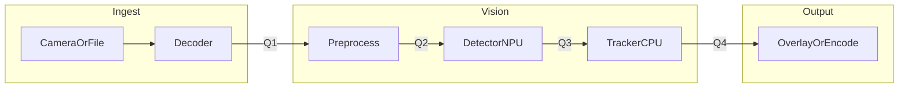
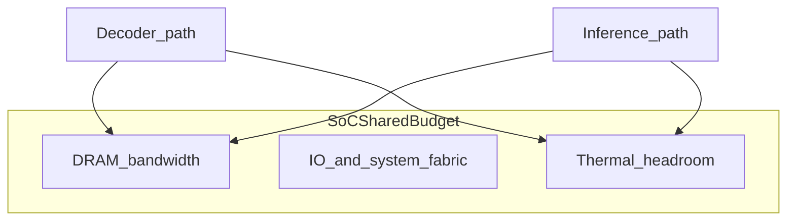

This note is a practical systems sketch for shipping **stable** video analytics on embedded SoCs. It stays **SDK-agnostic**: swap decoder, NPU runtime, and queue policies to fit your platform. Topics: DAG topology, buffer contracts, scheduling, and the limits (DRAM, thermal, fabric) that show up under real load, not only on slides.

**Goal:** reason about **p95/p99 latency**, drops, and jitter with the same discipline as OS scheduling and memory: name the bottleneck, then optimize the critical path.

## Table of contents

1. [Scenario](#1-scenario)
2. [DAG plus queues, not DAG alone](#2-dag-plus-queues-not-dag-alone)
3. [Map stages to executors](#3-map-stages-to-executors)
4. [Sample shape: stages and a minimal scheduler loop](#4-sample-shape-stages-and-a-minimal-scheduler-loop)
5. [Bottlenecks beyond FLOPs](#5-bottlenecks-beyond-flops)
6. [Profiling the critical path](#6-profiling-the-critical-path)
7. [Checklist](#7-checklist)

## 1. Scenario

Assume:

- One inbound stream: **1080p30** (could scale to N streams later).
- Decode from compressed video (vendor decoder on **DSP/VDEC** or CPU fallback).
- Preprocess: resize, mean/variance, layout conversion.
- Detector: **INT8** network on **NPU** (or GPU where that is the only option).
- Tracker and business logic: mostly **CPU**.
- Output: overlay, encode, or metadata only.

In production, the painful failure mode is usually not “model accuracy on a slide.” It is **p95/p99 latency**, **frame drops**, and **jitter** when the SoC gets hot or DRAM gets busy.

## 2. DAG plus queues, not DAG alone

A DAG drawn on a whiteboard is **topology**. A shipped engine needs **edges with semantics**:

- **Buffer ownership** (who allocates, who releases, who may alias).
- **Backpressure** (what happens when the next stage is slower).
- **Failure policy** (drop oldest, block, degrade resolution, skip inference every K frames).

The mental picture to implement is **DAG nodes plus bounded queues** between them, not only “node A calls node B.”



**Q1..Q4** are not decorative. They are where you implement **max depth**, **drop policy**, and **metrics** (wait time, utilization).

## 3. Map stages to executors

Below is a **pattern table**, not a universal law. Names change per vendor (DSP, VPU, NPU, GPU).

| Stage | Typical executor | Why | Risk if misplaced |
|-------|------------------|-----|---------------------|
| Decode | Hardware decoder or DSP | Bitstream work should not starve the rest | CPU pegged, everything else drifts |
| Preprocess | GPU shader, NEON, or vendor image DSP | High pixel volume | Extra copies through DRAM |
| Detector | NPU or GPU | Convolution-heavy | Deep queues hide latency until they explode |
| Tracker | CPU | Small tensors, branching logic | Lock contention if shared with unrelated work |

Scheduling here is not only “a thread pool.” It is **mapping nodes to executors** plus **policies** (priority, affinity, batching rules).

## 4. Sample shape: stages and a minimal scheduler loop

The following is **illustrative pseudo-C++** to show separation of concerns: **handles**, **queues**, **stage functions**, and **policy hooks**. It is not a drop-in library, same as command snippets in other blueprints here.

```cpp
// Opaque buffer id: pool index, dmabuf handle, or vendor token.
struct BufferHandle { uint32_t id; };

template <typename T>
struct BoundedQueue {
  bool try_push(const T&);   // returns false when full (backpressure)
  bool try_pop(T& out);
  size_t depth() const;
};

struct StageCtx {
  BoundedQueue<BufferHandle>* in_q;
  BoundedQueue<BufferHandle>* out_q;
};

void run_preprocess(StageCtx& ctx) {
  BufferHandle in, out;
  while (ctx.in_q->try_pop(in)) {
    // map in, produce out, or recycle on failure
    if (!allocate_output(out)) {
      release(in);
      continue;
    }
    preprocess(in, out);
    while (!ctx.out_q->try_push(out)) {
      // policy: spin, sleep, or drop according to product rules
    }
    release(in);
  }
}
```

**Review focus for this shape**

- Clear **ownership** transitions (`release`, `allocate_output`).
- A place to attach **metrics** (`depth()`, wait in `try_push`).
- No hidden copies in the “happy path” comments (real code still needs explicit sync).

## 5. Bottlenecks beyond FLOPs



**DRAM bandwidth:** Large feature maps, suboptimal strides, or extra color converts can saturate memory before the NPU runs out of ops.

**Thermal:** Sustained load reduces clocks. Jitter rises. A pipeline that looked fine for five minutes fails after twenty.

**PCIe / fabric:** Matters when accelerators or cameras are off-chip. Even on-chip, **contention** on shared buses still appears in integrated designs under stress.

## 6. Profiling the critical path

Use vendor tools where available (GPU/NPU timelines), plus system-wide views (**perf**, **eBPF**, **Nsight Systems**, or equivalents). Then:

1. Identify the **longest dependent chain** per frame (critical path).
2. Decide whether the next optimization belongs there or in **queue policy** and **memory traffic**.

Optimizing a kernel that is not on the critical path is a common way to waste weeks.

## 7. Checklist

1. Every edge between stages has **max queue depth** and **policy** under pressure.
2. You can name the **one** system bottleneck for your workload (DRAM, thermal, PCIe/fabric, or a specific stage).
3. Latency numbers are reported with **percentiles**, not only averages.
4. The team agrees what **degradation** means before it is needed in the field.

---

Illustrative architecture note. Tune numbers and policies to your SoC, OS, and product SLA, same as other playbooks on this site.
