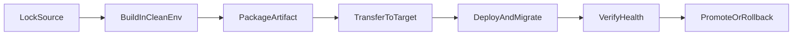

This playbook is a practical guide you can reuse for a web app, an API, or a multi-container stack. It stays framework-agnostic: swap service names, paths, and env vars to fit your project.

## Table of contents

1. [Executive summary](#1-executive-summary)
2. [Deployment architecture patterns](#2-deployment-architecture-patterns)
3. [Standard deployment flow](#3-standard-deployment-flow)
4. [Environment & secrets model](#4-environment--secrets-model)
5. [Build/runtime compatibility pitfalls](#5-buildruntime-compatibility-pitfalls)
6. [Database lifecycle](#6-database-lifecycle)
7. [Security baseline](#7-security-baseline)
8. [Incident response checklist](#8-incident-response-checklist)
9. [Docker/Compose handbook templates](#9-dockercompose-handbook-templates)
10. [Quick command templates](#10-quick-command-templates)

## 1. Executive summary

Goals:

- **Repeatable builds** — same inputs produce the same artifact.
- **Runtime parity** — what runs in prod matches what you tested.
- **Controlled releases** — you know what version is live.
- **Clear rollback** — you can go back without guessing.
- **Security & supply chain** — thought about early, not as an afterthought.

Standard flow:



## 2. Deployment architecture patterns

### 2.1 Build on the host (fast dev loop)

- **Pros:** quick feedback, easy debugging.
- **Cons:** your laptop OS/arch/libs may differ from the server → “works on my machine” surprises.

### 2.2 Build inside Docker (recommended for parity)

- Build in a Linux image that matches (or is very close to) production: same distro, libc (glibc vs musl), CPU arch.
- Use `docker build --platform ...` when the server arch differs from your laptop.

### 2.3 Build on CI, promote the artifact

- CI builds the image, tags it (semver or git SHA), pushes to a registry (GHCR, ECR, Harbor, etc.).
- The server only pulls and runs — no compiler toolchain on the VPS.

### 2.4 Artifact without a registry

- `docker save` → `.tar`, copy with `scp`/`rsync`, then `docker load` on the server.
- Good for air-gapped networks or minimal setups.

### 2.5 Minimal deploy surface

- Sync only what you need: compose files, scripts, env templates, optional image tar.
- Avoid syncing the whole repo if it is not required — smaller attack surface and faster transfers.

## 3. Standard deployment flow

### A. Prepare source and lock dependencies

- Commit lockfiles (`package-lock.json`, `pnpm-lock.yaml`, `go.sum`, etc.).
- Tag a release or at least record the exact commit you deploy.

### B. Build

- **Host build:** follow project README; keep build-time secrets out of production values.
- **Docker build:** prefer multi-stage; use `.dockerignore` so you do not copy `node_modules`, `.git`, or build cache junk into the image.

### C. Package

- Tag images clearly (`app:1.2.3`). Optionally export tar if you skip a registry.

### D. Transfer

- Registry: `docker push`.
- No registry: ship tar + compose + sample env.

### E. Release

- Start the database first with a **healthcheck**; wait until it is ready before starting app services that depend on it.
- Run migrations with a strategy that matches your downtime goals (zero-downtime often needs backward-compatible migrations).

### F. Verify

- Health/readiness checks pass.
- Smoke tests pass (a couple of critical paths).
- Logs show no boot loops or repeating errors.

### G. Rollback

- Keep the previous image tag handy.
- If a migration is risky, have a DB backup and a tested restore path.

## 4. Environment & secrets model

### 4.1 Config layers

- **Platform:** DB host, port, TLS mode — often injected on the server.
- **App:** API URLs, feature flags.
- **Runtime:** `NODE_ENV`, worker concurrency — changes less often across environments.

### 4.2 File conventions

- `.env.example` lists required keys — **no real secrets**.
- Real secrets live in a vault, a cloud secret manager, or a file on the server outside git.
- Never commit production `.env` files.

### 4.3 Rotate secrets

If you suspect a leak: rotate DB password, JWT/session secrets, and API keys — prioritize public-facing services first.

### 4.4 Changing only `.env` — do you need to rebuild the image?

- **Runtime env read at container start:** you **do not** need a new image. You **do** need to **recreate** the container so it picks up new env values (Docker does not hot-reload env for a running container).
- **Build-time variables** baked into the bundle (e.g. some `NEXT_PUBLIC_*` values): you **must** rebuild the app and image.

Minimal recreate:

```bash
docker compose -f deploy/docker-compose.yaml up -d --force-recreate web
```

Check env inside the container:

```bash
docker compose -f deploy/docker-compose.yaml exec web sh -c 'printenv | grep -E "DATABASE|API|NODE" | sort'
```

## 5. Build/runtime compatibility pitfalls

### 5.1 CPU architecture mismatch

- Building `arm64` and running `amd64` (or the reverse) causes errors or slow emulation.
- **Fix:** build with the correct `--platform`, or build on CI that targets the server arch.

### 5.2 glibc vs musl (Alpine)

- Native binaries (ORM, crypto) may behave differently.
- **Fix:** build and test with the same base image family you use in production.

### 5.3 OpenSSL / TLS library mismatch

- Do not run binaries built for macOS against Linux without rebuilding or using a compatible engine for the target.

### 5.4 `node_modules` copied from the host into the image

- Always exclude with `.dockerignore`.
- Install dependencies **inside** the Dockerfile (`npm ci`).

## 6. Database lifecycle

- Use explicit volumes for data (bind mount or named volume).
- Wait for the DB to be ready before import/migrate jobs.
- Schedule backups; take a snapshot before large migrations.

## 7. Security baseline

### Container

- Run as non-root when possible.
- Read-only root filesystem for the app layer when it fits your app.
- Set CPU/memory limits so one container cannot starve the node.

### Edge

- Reverse proxy: TLS termination, sensible timeouts, body size limits.
- Rate limit sensitive routes (`/auth`, `/api/login`).

### App

- Do not execute shell commands built from raw user input.
- Validate redirect URLs (avoid open redirects).
- Use high-entropy secrets for sessions/JWT.

### Supply chain

- Lock dependencies with lockfiles.
- Use `npm ci` (or equivalent) in CI — avoid ad-hoc `install` on production paths.
- Run vulnerability scans (`npm audit`, OSV) on a schedule.

## 8. Incident response checklist

### Warning signs

- Logs suggesting RCE: `curl | sh`, `base64 -d | sh`, changes to `authorized_keys`, odd processes.
- CPU/memory spikes that do not match real traffic.
- Brute-force traffic or random paths.

### Act fast

1. Reduce public exposure (firewall / security group) if needed.
2. Collect logs and runtime forensics (`docker inspect`, `docker diff`, process list).
3. Compare image digest/tag with a clean CI build.
4. Rotate secrets that might be exposed.
5. Redeploy from a trusted source and watch closely for 24–48 hours.

## 9. Docker/Compose handbook templates

### 9.1 `.dockerignore`

```text
.git
.github
*.md
.env
.env.*
!.env.example
node_modules
**/node_modules
**/dist
**/.next/cache
coverage
*.log
```

### 9.2 Dockerfile API (multi-stage)

```dockerfile
FROM node:20-bookworm-slim AS builder
WORKDIR /app
COPY services/api/package.json services/api/package-lock.json* ./
RUN npm ci --omit=dev
COPY services/api .
RUN npm run build

FROM node:20-bookworm-slim
WORKDIR /app
ENV NODE_ENV=production
COPY --from=builder /app/package.json ./
COPY --from=builder /app/node_modules ./node_modules
COPY --from=builder /app/dist ./dist
RUN addgroup --system app && adduser --system --ingroup app app \
  && chown -R app:app /app
USER app
EXPOSE 4000
CMD ["node", "dist/server.js"]
```

### 9.3 Dockerfile web static (Nginx)

```dockerfile
FROM nginx:1.27-alpine
COPY apps/web/dist /usr/share/nginx/html:ro
EXPOSE 80
```

### 9.4 Docker Compose template

```yaml
name: acme-local

services:
  db:
    image: postgres:16-alpine
    environment:
      POSTGRES_USER: app
      POSTGRES_PASSWORD: ${DB_PASSWORD}
      POSTGRES_DB: app
    volumes:
      - pgdata:/var/lib/postgresql/data
    ports:
      - "127.0.0.1:5432:5432"
    healthcheck:
      test: ["CMD-SHELL", "pg_isready -U app -d app"]
      interval: 5s
      timeout: 3s
      retries: 10

  api:
    build:
      context: ..
      dockerfile: deploy/Dockerfile.api
    image: myorg/api:${APP_VERSION:-latest}
    env_file:
      - ../services/api/.env
    environment:
      DATABASE_URL: postgresql://app:${DB_PASSWORD}@db:5432/app
      PORT: 4000
    ports:
      - "127.0.0.1:4000:4000"
    depends_on:
      db:
        condition: service_healthy
    restart: unless-stopped

  web:
    build:
      context: ..
      dockerfile: deploy/Dockerfile.web
    image: myorg/web:${APP_VERSION:-latest}
    ports:
      - "127.0.0.1:8080:80"
    depends_on:
      - api
    restart: unless-stopped

volumes:
  pgdata:
```

### 9.5 Runtime env sample

```bash
DB_PASSWORD=change-me-strong
APP_VERSION=1.0.0
```

## 10. Quick command templates

### Build and run

```bash
export DOCKER_DEFAULT_PLATFORM=linux/amd64
docker compose --env-file deploy/.env -f deploy/docker-compose.yaml build --no-cache
docker compose --env-file deploy/.env -f deploy/docker-compose.yaml up -d
docker compose -f deploy/docker-compose.yaml ps -a
```

### Logs and debug

```bash
docker compose -f deploy/docker-compose.yaml logs -f --tail=200 api web
docker compose -f deploy/docker-compose.yaml exec api sh -c 'printenv | sort'
docker compose -f deploy/docker-compose.yaml config
docker stats --no-stream
```

### Tar-based deploy (no registry)

```bash
docker save -o deploy/images/api.tar myorg/api:1.0.0
docker save -o deploy/images/web.tar myorg/web:1.0.0
scp deploy/images/*.tar user@vps:/opt/acme/images/
```

---

## Architecture diagram (export)

Vector diagram for slides or docs (sharp at any zoom):


