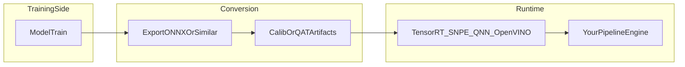
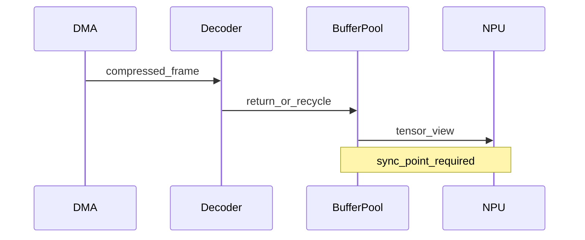

Companion to [Edge Video AI Pipelines: DAG Runtimes, Queues, and System Bottlenecks](/systems/edge-ai-pipeline-dag-runtime-bottlenecks): that one covers **throughput and scheduling**; this one covers **model artifacts**, **memory contracts**, and **portability** across SoCs. It stays **runtime-agnostic**: plug in TensorRT, SNPE, QNN, OpenVINO, or whatever your board ships with.

**Goal:** keep export, calibration, and buffer ownership as explicit as CI and deployment steps in the other blueprints here.

## Table of contents

1. [Three layers of responsibility](#1-three-layers-of-responsibility)
2. [PTQ versus QAT in one practical table](#2-ptq-versus-qat-in-one-practical-table)
3. [What native support means in an engine](#3-what-native-support-means-in-an-engine)
4. [Zero-copy versus synchronization](#4-zero-copy-versus-synchronization)
5. [Sample: explicit buffer ownership](#5-sample-explicit-buffer-ownership)
6. [HAL sketch: capability flags](#6-hal-sketch-capability-flags)
7. [Checklist](#7-checklist)

## 1. Three layers of responsibility



- **Training side:** accuracy, regularization, sometimes QAT graphs.
- **Conversion:** operator support, fusion rules, calibration tensors, optional sparsity.
- **Runtime + engine:** tensor layouts, batching rules, device placement, buffer lifetimes, **fallback** when an op is missing.

The important part is the **contracts** between these layers, not only the export file format.

## 2. PTQ versus QAT in one practical table

| Topic | PTQ | QAT |
|-------|-----|-----|
| Engineering cost | Lower | Higher |
| Accuracy under domain shift | More fragile | Usually better |
| Good fit | Stable inputs, rapid iteration | Safety-critical or wide scene variance |

Neither PTQ nor QAT replaces **measurement** on device. On the edge, **latency**, **memory**, and **worst-case** behavior decide whether a graph ships.

## 3. What native support means in an engine

“Native support” should mean more than **loading a file**. A useful pipeline engine tracks:

- **Expected tensor layouts** per backend (NCHW vs NHWC, packed formats).
- **Quantization parameters** per tensor where applicable (scales, zero points).
- **Batching policy** (fixed batch, dynamic shapes, padding rules).
- **Degradation paths** when an op is unsupported (partition graph, CPU fallback, or refuse to run).

That avoids a graph that looks fine on desktop but **cannot be scheduled** reliably on device.

## 4. Zero-copy versus synchronization

Zero-copy (shared pools, **DMA**-friendly buffers, importer APIs) cuts **memcpy** overhead. It does **not** remove:

- **Cache coherency** work when CPU and accelerator share memory maps.
- **Fences / events** between producers and consumers.
- **Lifetime rules**: who is allowed to overwrite a buffer while another stage still reads it.



## 5. Sample: explicit buffer ownership

Illustrative pseudo-C++:

```cpp
enum class Owner { Decoder, Preprocess, NPU, CPU };

struct FrameBuffer {
  void*  y;
  void*  uv;
  size_t stride_y;
  Owner  owner;
};

bool handoff(FrameBuffer& fb, Owner from, Owner to) {
  if (fb.owner != from) return false;
  fb.owner = to;
  // insert SoC-specific cache ops / fences here
  return true;
}
```

The point is not the enum itself. It is **making illegal ownership states hard to commit** in review and in runtime asserts.

## 6. HAL sketch: capability flags

Instead of `#ifdef` for every SoC inside business logic, expose **capabilities** the graph compiler or runtime can query:

| Flag | Meaning for the engine |
|------|-------------------------|
| `kResizeOnFastIP` | Prefer fixed-function or DSP resize to save CPU/GPU |
| `kInt8PreferredPath` | Prefer INT8-capable accelerator for conv-heavy graphs |
| `kDmabufImporter` | Import camera or decoder buffers without extra copies |

```cpp
struct DeviceCaps {
  bool resize_on_fast_ip;
  bool int8_preferred_path;
  bool dmabuf_importer;
};

DeviceCaps probe(const char* platform_id);
```

Graph lowering reads **caps** and chooses backends. Product code stays stable; new SoCs add **probe** data only at the boundary.

## 7. Checklist

1. Calibration and QAT artifacts are versioned with the **exact** export pipeline used in CI.
2. Each buffer transition has a named **owner** and a **sync rule**.
3. Fallback paths are **tested**, not only listed in documentation.
4. HAL exposes **capabilities**, not raw vendor headers, at the boundary under your control.

---

Illustrative architecture note. Backend names are examples; validate against your vendor SDKs and safety requirements, same as other playbooks on this site.
